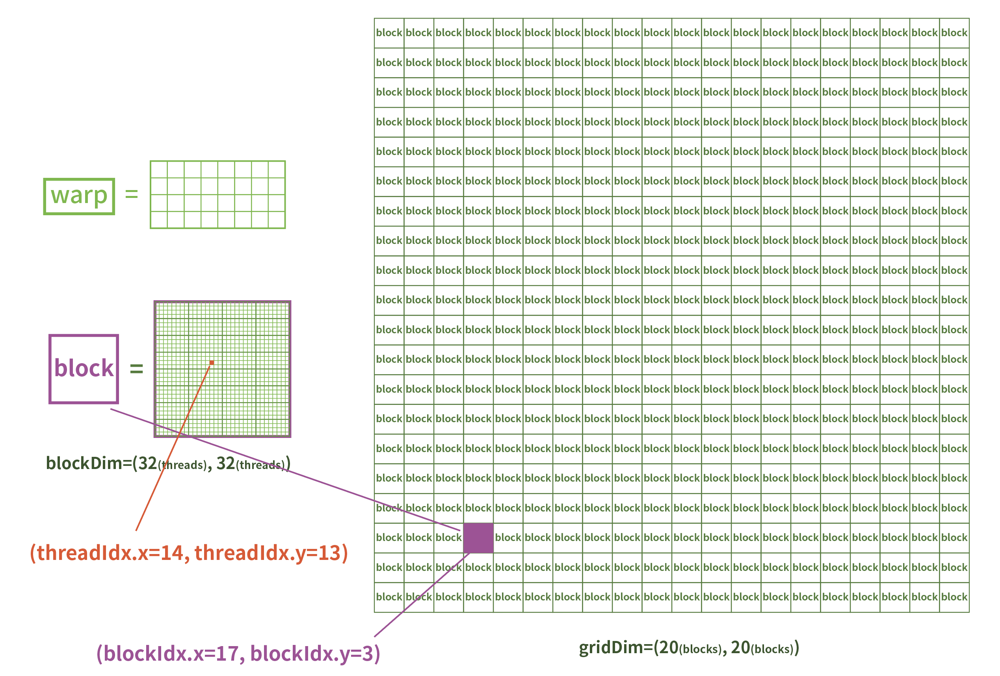
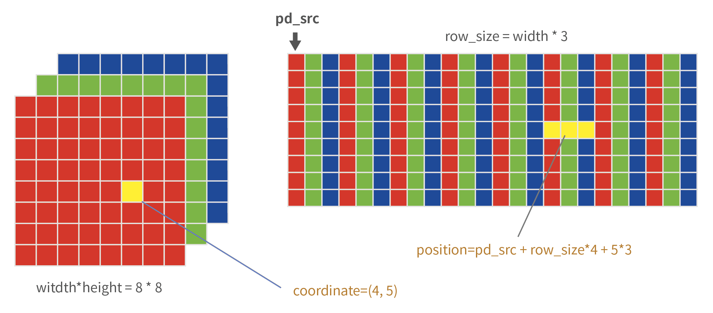

# warpAffine
## 1 任务描述
- 将原图 src（width*height） 转换为目标图 dst（640\*640），或者是任何网络模型推理需要的尺寸

<div align = center>
    
</div>
&emsp;

## 2 任务分析
- 通常情况下，原图都是比推理使用的图要大，像素比目标图要多，多数情况做的是缩小，所以
    - 变换主要是：缩小 + 平移（图像坐标原点在左上角）
    - 计算量考虑：我们要的是目标图，缩小过程中原图像素会丢失，遍历目标图比遍历原图计算量小，从目标图的像素找原图的像素来的确定

&emsp;
## 3 实现过程
## 3.1 main.cpp
>头文件、宏定义和结构体
```c++
#include <cuda_runtime.h>
#include <opencv2/opencv.hpp>
#include <stdio.h>
#include <iostream>

using namespace cv;
using namespace std;

// 宏定义一个取较小值的函数
#define min(a,b) ((a)<(b) ? (a) : (b))

// 检查运行时的错误
// 先宏定义声明，再实现
#define checkRuntime(op) __check_cuda_runtime((op), #op, __FILE__, __LINE__)
bool __check_cuda_runtime(cudaError_t code, const char* op, const char* file, int line){
    if(code != cudaSuccess){
        const char* err_name = cudaGetErrorName(code);
        const char* err_msg  = cudaGetErrorString(code);
        printf("CUDA runtime error[%s:%d] %s failed, Error: %s, msg: %s\n", file, line, err_name, err_msg);
        return false;
    }
    return true;
}

struct GPUData{
    int width  = 0;
    int height = 0;
    int size   = 0;
    int row_size = 0;
    uint8_t* data = nullptr;
    GPUData() = default;
    GPUData(int _height, int _width): height(_height), width(_width){
        row_size = width*3;
        size = width*height*3;
    }
};
```


>main 函数
```c++
int main(int argc, char** argv){
    Mat image = imread("zand.jpg");
    Mat output = malloc_and_call(image, Size(640, 640));
    imwrite("output.jpg", output);
    printf("Done. Save to output.jpg\n");
    return 0;
}
```


>malloc_and_call 函数具体实现
- 在 GPU 上分配两个内存：
    - srcSize = 图片高 x 图片宽 x 3通道
    - dstSize = 图片高 x 图片宽 x 3通道
    - 注意：这些内存都是连续存储的（这就解释了下面计算 index 的方式）

<div align = center>
    
</div>
&emsp;

```c++
// 先声明，以便下面函数调用。实现在 .cu 文件
void lauch_kernel(GPUData& srcGPU, GPUData& dstGPU, uint8_t fill_value);

Mat malloc_and_call(const Mat& srcImg, const Size& dstSize){
    Mat output(dstSize, CV_8UC3);
    GPUData srcGPU(srcImg.rows, srcImg.cols);
    GPUData dstGPU(dstSize.height, dstSize.width);
    // 分配内存
    checkRuntime(cudaMalloc(&srcGPU.data, srcGPU.size));
    checkRuntime(cudaMalloc(&dstGPU.data, dstGPU.size));
    checkRuntime(cudaMemcpy(srcGPU.data, srcImg.data, srcGPU.size, cudaMemcpyHostToDevice));
    // 启动核函数的函数
    lauch_kernel(srcGPU, dstGPU, 114);
    // 检查错误
    checkRuntime(cudaPeekAtLastError());
    checkRuntime(cudaMemcpy(output.data, dstGPU.data, dstGPU.size, cudaMemcpyDeviceToHost));
    checkRuntime(cudaFree(srcGPU.data));
    checkRuntime(cudaFree(dstGPU.data));
    return output;
}
```

&emsp;
## 3.2 warpaffine.cu
>头文件和结构体
- uin8_t 原来定义在 stdio.h；Size 原来定义在 opencv 的 types.hpp 里面
- cu 文件好像不能用上面两个头文件，会报错
```c++
#include <cuda_runtime.h>
#include <stdio.h>
#define min(a, b) ((a) < (b) ? (a) : (b))

typedef unsigned char uint8_t;

struct GPUData{
    int width  = 0;
    int height = 0;
    int size   = 0;
    int row_size = 0;
    uint8_t* data = nullptr;
    GPUData() = default;
    GPUData(int _height, int _width): height(_height), width(_width){
        row_size = width*3;
        size = width*height*3;
    }
};

struct Pixel{
    int x=0, y=0;
    uint8_t* data;
    float c0, c1, c2;
};

struct SrcPoint{
    float x=0.0, y=0.0;
    // 周围的4个像素点
    Pixel p1; // left top
    Pixel p2; // right top
    Pixel p3; // left bottom
    Pixel p4; // right bottom
    float w1, w2, w3, w4;
};
```
launch_kernel 函数
- 核函数分配线程
    - 一个 warp 有 32 个 CUDA Cores（不一定是4x8的排列，这里只是方便演示），这是后面 block 其中一个维度设置 32 的原因，CUDA 是一个 warp（32）个线程启动的
    - 这里设置了 
        - block_size(32, 32)，即每个 block 有 32x32 个线程（cuda cores）
        - grid_size(20, 20)，即 20x20 个 blocks

    <div align = center>
        
    </div>
    &emsp;

```c++
void lauch_kernel(
    GPUData& srcGPU, GPUData& dstGPU, uint8_t fill_value)
{
    dim3 block_size(32, 32);
    dim3 grid_size((dstGPU.width+31)/32, (dstGPU.height+31)/32);
    AffineMatrix affine;
    affine.compute(srcGPU, dstGPU);
    // 核函数调用
    // <<<gridDim, blockDim, shared_memory, stream>>>
    warpaffine_bilinear_kernel<<<grid_size, block_size, 0, nullptr>>>(
        srcGPU, dstGPU, 
        affine, fill_value
    );
}
```

&emsp;
>compute 函数
- 计算原图到目标图的变换矩阵
- 在结构体 AffineMatrix 中
<div align = center>
    
    <h4>第1步: 缩放<h>
</div>

<div align = center>
    
    <h4>第2步: 平移<h>
</div>


```c++
void compute(const GPUData srcGPU, const GPUData dstGPU){
    float scale_x = dstGPU.width  / (float)srcGPU.width;
    float scale_y = dstGPU.height / (float)srcGPU.height;

    float scale = min(scale_x, scale_y);
    i2d[0] = scale;  i2d[1] = 0;  i2d[2] = 
        -scale * srcGPU.width  * 0.5  + dstGPU.width * 0.5 + scale * 0.5 - 0.5;

    i2d[3] = 0;  i2d[4] = scale;  i2d[5] = 
        -scale * srcGPU.height * 0.5 + dstGPU.height * 0.5 + scale * 0.5 - 0.5;

    getInvertMatrix(i2d, d2i);
}
```

&emsp;
>invertAffineTransform 函数
- 计算逆矩阵
    $imat = \mathbf{A} = \begin{bmatrix}i_{00} & i_{01} & i_{02}\\
                        i_{10} & i_{11} & i_{12}\\
                        0 & 0 & 1\end{bmatrix}, 
    A^{-1} = \frac{\mathbf{A}^{*}}{|\mathbf{A}|}$
    - 行列式 determinant：$\mathbf{D}=|\mathbf{A}|=i_{00}*i_{11} - i_{01}*i_{10}$

    - 余子式：$M_{00} = \begin{vmatrix} i_{11} & i_{12} \\ 0 & 1\end{vmatrix}$，$M_{01} = \begin{vmatrix} i_{10} & i_{12} \\ 0 & 1\end{vmatrix}$ ...
    - 代数余子式：$\mathbf{A}_{00} = (-1)^{0+0}\mathbf{M}_{00}$，$\mathbf{A}_{01} = (-1)^{0+1}\mathbf{M}_{01}$ ...
    - 伴随矩阵：$\mathbf{A}^{*} = \begin{bmatrix} 
    \mathbf{A}_{00} & \mathbf{A}_{10} & \mathbf{A}_{20} \\ 
    \mathbf{A}_{01} & \mathbf{A}_{11} & \mathbf{A}_{21} \\
    \mathbf{A}_{02} & \mathbf{A}_{12} & \mathbf{A}_{22}
    \end{bmatrix} = \begin{bmatrix} i_{11} & -i_{10} & -A_{00}*i_{02} - A_{01}*i_{12}\\
    -i_{01} & i_{00} & -A_{10}*i_{02} - A_{11}*i_{12} \\ 0 & 0 & 1
    \end{bmatrix}$

```c++
void getInvertMatrix(float imat[6], float omat[6]){
    // 原矩阵 imat
    float i00=imat[0], i01=imat[1], i02=imat[2],
            i10=imat[3], i11=imat[4], i12=imat[5];
            //       0 ,          0 ,          1
    // 原矩阵的行列式 1/D
    float D = i00*i11 - i01*i10;
    D = D != 0 ? 1.0 / D : 0;

    // 这里就是 伴随矩阵/D
    float A00 = i11 * D, A10 = -i10 * D,
            A01 =-i01 * D, A11 =  i00 * D;
    float A20 = -A00*i02 - A01 * i12,
            A21 = -A10*i02 - A11 * i12;

    // 得到的逆矩阵
    omat[0]=A00, omat[1]=A10, omat[2]=A20,
    omat[3]=A01, omat[4]=A11, omat[5]=A21;      
}
```

&emsp;
>warpaffine_bilinear_kernel 函数
- 在这个函数里面调用 `__global__` 核函数
- 计算 index(x, y)，将线程与 dst 的图像像素对应起来，这样就能保证每一个像素都是单独由一个线程负责处理了
    - 线程在 Grid 中的 x = dst 图像的 x = blockDim.x * blockIdx.x + threadIdx.x; 
    - 线程在 Grid 中的 y = dst 图像的 y = blockDim.y * blockIdx.y + threadIdx.y;
        <div align = center>
            
        </div>
        &emsp;
- 里面调用 `__device__` 函数
- 找到 srcPoint 坐标之后，做双线性插值
- 找出 srcPoint 周围的4个像素坐标
- 计算每个像素所占的比例
- 用面积的思想计算权重, 注意这里是反过来的，如：（353，265）的权重是 0.22 x 0.68
    <div align = center>
        
    </div>
- 计算 4 个像素的指针
    <div align = center>
        
    </div>

    ```c++
    __global__ void warpaffine_bilinear_kernel(
        GPUData srcGPU, GPUData dstGPU, 
        AffineMatrix matrix, uint8_t fill_value
    ){
        // printf("%d x %d\n", srcGPU.height, srcGPU.width);
        Pixel dstPoint; SrcPoint srcPoint;
        dstPoint.x = blockDim.x * blockIdx.x + threadIdx.x;
        dstPoint.y = blockDim.y * blockIdx.y + threadIdx.y;
        if(dstPoint.x >= dstGPU.width || dstPoint.y >= dstGPU.height) return;
        // dstPoint 通过逆矩阵投影找到 srcPoint
        affine_project(matrix.d2i, dstPoint, srcPoint);
        // 开始做双线性差值
        dstPoint.c0 = fill_value;
        dstPoint.c1 = fill_value;
        dstPoint.c2 = fill_value;
        // 上面先给 dstPoint 3 个通道默认值
        if(srcPoint.x < -1 || srcPoint.x >= srcGPU.width || 
        srcPoint.y < -1 || srcPoint.y >= srcGPU.height){
            // 保证只处理原图上的像素点
        }else{

            int coord_x_low = floorf(srcPoint.x);
            int coord_y_low = floorf(srcPoint.y);
            int coord_x_high = coord_x_low + 1;
            int coord_y_high = coord_y_low + 1;
            // srcPoint 周围的4个像素确定坐标
            srcPoint.p1.x=coord_x_low;  srcPoint.p1.y=coord_y_low;
            srcPoint.p2.x=coord_x_high; srcPoint.p2.y=coord_y_low;
            srcPoint.p3.x=coord_x_low;  srcPoint.p3.y=coord_y_high;
            srcPoint.p4.x=coord_x_high; srcPoint.p4.y=coord_y_high;

            // 计算每个像素 x, y 方向上的比例
            float portion_x_low = srcPoint.x - coord_x_low;
            float portion_y_low = srcPoint.y - coord_y_low;
            float portion_x_high = 1 - portion_x_low;
            float portion_y_high = 1 - portion_y_low;
            
            // 计算权重
            srcPoint.w1 = portion_x_high * portion_y_high;
            srcPoint.w2 = portion_x_low  * portion_y_high;
            srcPoint.w3 = portion_x_high * portion_y_low;
            srcPoint.w4 = portion_x_low  * portion_y_low;
            
            // 下面的 4 个 if 语句都是为了保证只对在 src 上的像素取值
            if(srcPoint.p1.x >= 0 || srcPoint.p1.y >= 0)
                srcPoint.p1.data = srcGPU.data + srcPoint.p1.y * srcGPU.row_size + srcPoint.p1.x*3;

            if(srcPoint.p2.x <= srcGPU.width || srcPoint.p2.y >= 0)
                srcPoint.p2.data = srcGPU.data + srcPoint.p2.y * srcGPU.row_size + srcPoint.p2.x*3;

            if(srcPoint.p3.x >= 0 || srcPoint.p3.y <= srcGPU.height)
                srcPoint.p3.data = srcGPU.data + srcPoint.p3.y * srcGPU.row_size + srcPoint.p3.x*3;

            if(srcPoint.p4.x <= srcGPU.width || srcPoint.p4.y <= srcGPU.height)
                srcPoint.p4.data = srcGPU.data + srcPoint.p4.y * srcGPU.row_size + srcPoint.p4.x*3;

            dstPoint.c0 = floorf(
                srcPoint.w1*srcPoint.p1.data[0] + srcPoint.w2*srcPoint.p2.data[0] + srcPoint.w3*srcPoint.p3.data[0] + srcPoint.w4*srcPoint.p4.data[0]);
            dstPoint.c1 = floorf(
                srcPoint.w1*srcPoint.p1.data[1] + srcPoint.w2*srcPoint.p2.data[1] + srcPoint.w3*srcPoint.p3.data[1] + srcPoint.w4*srcPoint.p4.data[1]);
            dstPoint.c2 = floorf(
                srcPoint.w1*srcPoint.p1.data[2] + srcPoint.w2*srcPoint.p2.data[2] + srcPoint.w3*srcPoint.p3.data[2] + srcPoint.w4*srcPoint.p4.data[2]);
        }
        dstPoint.data = dstGPU.data + dstPoint.y*dstGPU.row_size + dstPoint.x*3;
        // if 语句内的 dstPoint 通道值按算好的来，剩下的 dstPoint 三个通道值都是114
        dstPoint.data[0] = dstPoint.c0;
        dstPoint.data[1] = dstPoint.c1;
        dstPoint.data[2] = dstPoint.c2;
    }
    ```

&emsp;
>affine_project 函数
- dst 像素点通过逆矩阵投影到 src 上的函数，计算结果为浮点数

```c++
__device__ void affine_project(float* matrix, Pixel& dstPoint, SrcPoint& srcPoint){
    srcPoint.x = matrix[0]*dstPoint.x + matrix[1]*dstPoint.y + matrix[2];
    srcPoint.y = matrix[3]*dstPoint.x + matrix[4]*dstPoint.y + matrix[5];
}
```


